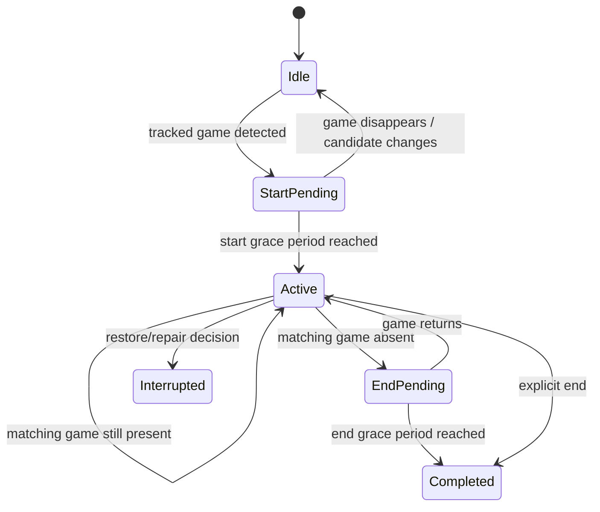

# GameLog Software Design Document

**Document status:** Implementation-aligned working design  
**Version:** 0.2  
**Date:** 2026-08-18  
**Project type:** Solo portfolio project  
**Primary platform:** Linux desktop  
**Language / framework:** C++23, Qt 6, SQLite  
**Working name:** GameLog

---

## 1. Purpose

GameLog is a local-first Linux desktop application for tracking PC game sessions. It maintains a library of games, detects configured games from running processes, creates and completes play sessions, stores session notes, synchronizes owned-game metadata from Steam, retrieves game artwork, and presents the data through Qt Widgets interfaces.

This document is intended to serve two purposes:

1. **Developer reference** for the current architecture, invariants, and expected behavior.
2. **AI handoff context** for future coding, testing, refactoring, and design sessions.

Unlike the original design document, this revision distinguishes clearly between:

- **Implemented/current architecture** — behavior represented by the current source tree and the 2026-08-18 contract-adherence revision.
- **Contracted behavior** — behavior that tests and future edits should preserve even when an implementation is still being stabilized.
- **Future/aspirational architecture** — features that remain useful goals but are not part of the current implementation.

Future AI sessions should not treat aspirational sections as already implemented.

---

## 2. Source-of-Truth Order

When this document, source code, tests, migrations, or older design notes disagree, use the following precedence:

1. **Current source code and SQL migrations in the working repository.**
2. **Automated tests that intentionally encode the behavioral contracts in this document.**
3. **The behavioral contract sections of this document, especially Appendix A.**
4. **Implementation notes and diagrams in this document.**
5. **Older design documents, TODO comments, or exploratory discussions.**

The source tree is still under active development. If a source file contradicts a contract that has already been deliberately established and tested, treat the disagreement as a likely regression rather than silently redefining the contract.

---

## 3. Project Goals

### 3.1 Current primary goals

The current project aims to provide a lightweight local application that can:

- Maintain a SQLite-backed game library.
- Add, update, remove, filter, and list games through service/repository layers.
- Synchronize owned Steam games through the Steam Web API.
- Store Steam credentials through the system keychain rather than in SQLite.
- Detect tracked games from Linux process snapshots.
- Use Steam process identity when available and executable paths as a fallback.
- Track exactly one active session at a time.
- Apply start and end grace periods to automatic detection.
- Persist session status, timestamps, duration, and notes.
- Recover persisted active-session state at runtime startup.
- Repair inconsistent persisted active-session rows where possible.
- Download and validate Steam artwork into application-owned local storage.
- Display the game library, calendar information, active-session state, artwork, and notes through Qt Widgets.
- Support headless process tracking as well as GUI launch modes from the same executable.
- Remain testable despite keychain, network, clock, filesystem/process, and Qt dependencies.

### 3.2 Learning goals

The project remains useful for gaining experience with:

- Modern C++23 application development.
- Qt 6 object ownership, signals/slots, Widgets, Network, SQL, and GUI facilities.
- SQLite migrations and repository design.
- Linux process inspection and libproc2.
- Test seams around nondeterministic dependencies.
- CMake and automated testing with Qt Test / CTest.
- Local application storage and Linux packaging.
- Architectural separation between UI, application services, repositories, and infrastructure.

### 3.3 Current non-goals

The following are not part of the current implementation contract:

- Windows or macOS support.
- Multiple simultaneously active sessions.
- Cloud synchronization or user accounts.
- Social features.
- Backloggd integration.
- Multiple executable launch profiles per game.
- Remote control or network servers.
- Full plugin architecture.
- Advanced note search, AI summarization, audio recording, or transcription.
- Automatic game-window manipulation.
- Guaranteed uniqueness of executable paths.

Some of these remain future extension candidates.

---

## 4. Implementation Status Summary

| Area | Status | Current design |
|---|---|---|
| Single executable | Implemented | `gamelog` runs as `--headless`, `--gui`, or `--live`. |
| Runtime ownership | Implemented | `GameLogRuntime` owns long-lived repositories/services and process tracking infrastructure. |
| SQLite persistence | Implemented | Qt SQL repositories plus ordered migrations. |
| Game CRUD/query | Implemented | `GameService` delegates persistence to `GameRepository`. |
| Session CRUD/query | Implemented | `SessionService` delegates persistence to `SessionRepository`. |
| One active session | Contracted/implemented | Enforced in service lifecycle and repaired during restore. |
| Linux process detection | Implemented | `ProcfsProcessSource` uses libproc2; higher layers accept `ProcessInfo` snapshots. |
| Steam process annotation | Implemented | `/proc/<pid>/environ` is inspected for `SteamAppId` and cached. |
| Steam library sync | Implemented | Steam Web API `GetOwnedGames`; existing App IDs are preserved rather than overwritten. |
| Credential storage | Implemented | `CredentialService` uses the system keychain abstraction. |
| Artwork download | Implemented | Steam CDN cover/header/logo download with image decoding validation. |
| Artwork completeness | Contracted/implemented | A valid `cover.jpg` currently defines `Game.hasArtwork`. |
| Main/library/calendar/live GUI | Partial | Existing Qt Widgets pages provide the currently implemented GUI surface. |
| Note editing | Partial | Current `TextEditor` produces Markdown and `LiveWindow` persists it on session completion. |
| Separate background agent | Planned only | The earlier `gamelog-agent`/IPC split is not current architecture. |
| Local IPC | Planned only | No `QLocalServer`/`QLocalSocket` ownership split exists in the current design. |
| systemd user service | Planned only | May be introduced later around headless mode or a future agent. |
| System tray / multiple compact modes | Planned only | Not part of the current implemented surface. |
| QSettings configuration system | Planned only | Current grace/poll values are largely compile-time or entry-point constants. |
| HTML note model/export | Planned/reconsidered | Current persisted note payload is Markdown text, not canonical HTML. |

---

## 5. Current System Architecture

GameLog currently uses **one executable** and a layered in-process architecture.

```mermaid
flowchart TB
    Main[main.cpp] --> Runtime[GameLogRuntime]

    Runtime --> DBM[DatabaseManager]
    DBM --> Migrator[DatabaseMigrator]
    DBM --> SQLite[(SQLite)]

    Runtime --> GR[GameRepository]
    Runtime --> SR[SessionRepository]
    GR --> SQLite
    SR --> SQLite

    Runtime --> Cred[CredentialService]
    Runtime --> Steam[SteamApiService]
    Runtime --> GS[GameService]
    Runtime --> SS[SessionService]
    Runtime --> Art[GameArtworkService]

    Cred --> Steam
    Steam --> GS
    GR --> GS
    SR --> SS
    GS --> SS

    Runtime --> PS[ProcessSource]
    PS --> Procfs[ProcfsProcessSource / libproc2]
    Runtime --> Inspector[SteamProcessInspector]
    Inspector --> ProcEnv[/proc PID environ]

    GS --> MatchIndexes[Tracked Steam/path indexes]
    MatchIndexes --> SS

    Runtime --> GUI[Qt Widgets]
    GUI --> GS
    GUI --> SS
    GUI --> Art
```

### 5.1 Architectural direction

The central design principle is:

> **Widgets request application behavior through services; services own application state and rules; repositories own SQL; infrastructure-specific dependencies remain below those boundaries.**

The project is not using a strict textbook MVC implementation. Views may call application services to request data and operations, while domain persistence and lifecycle decisions remain outside the widgets.

---

## 6. Entry Point and Run Modes

`main.cpp` accepts exactly one run-mode argument:

```text
--headless
--gui
--live
```

No mode, duplicated modes, mixed modes, unknown arguments, or extra arguments are startup errors.

### 6.1 `--headless`

Creates a `QCoreApplication`, starts `GameLogRuntime`, polls processes, and performs automatic tracking without constructing a main window.

### 6.2 `--gui`

Creates a `QApplication`, starts the same runtime, and shows `MainWindow`.

### 6.3 `--live`

Creates a `QApplication`, starts the same runtime, and shows `LiveWindow`, focused on the active-session experience.

### 6.4 Runtime lock

The process creates a `QLockFile` under the user's runtime directory, falling back to the temporary directory when necessary. The lock prevents two GameLog processes from simultaneously owning tracking and the database.

### 6.5 Polling interval

The current entry point drives `GameLogRuntime::update()` every five seconds.

This value is currently an implementation constant rather than a persisted user setting.

---

## 7. `GameLogRuntime`

`GameLogRuntime` is the application composition root and owner of long-lived runtime dependencies.

### 7.1 Owned components

The runtime owns or conditionally constructs:

- `DatabaseManager`
- `GameRepository`
- `SessionRepository`
- `CredentialService`
- `SteamApiService`
- `GameService`
- `SessionService`
- `GameArtworkService`
- `ProcessSource`
- `SteamProcessInspector`

Repositories and services are constructed only after database initialization succeeds.

### 7.2 Startup

`start()`:

1. Rejects starting an already-running runtime.
2. Verifies database/services are ready.
3. Creates the production process source.
4. Rebuilds `GameService`'s tracked-game indexes from persistence.
5. Restores and repairs persisted active-session state.
6. Marks the runtime running.

### 7.3 Stop and restart

`stop()`:

- Marks the runtime stopped.
- Releases the current process source.
- Resets automatic-tracking transient state.
- Does **not** automatically complete an active persisted session.

The same `GameLogRuntime` instance is expected to support:

```text
start() -> stop() -> start()
```

A new process source is created on each successful start.

### 7.4 Single-runtime policy

The fixed database connection name `GameLogRuntimeConnection`, together with the application lock, intentionally expresses a one-live-runtime-per-process/application policy.

---

## 8. Source Layout

The current source structure is approximately:

```text
src/
├── application/
│   ├── GameLogRuntime.cpp/.h
│   └── services/
│       ├── local/
│       │   ├── CredentialService.cpp/.h
│       │   ├── GameService.cpp/.h
│       │   └── SessionService.cpp/.h
│       └── web/
│           ├── GameArtworkService.cpp/.h
│           └── SteamApiService.cpp/.h
├── core/
│   ├── database/
│   │   ├── DatabaseManager.cpp/.h
│   │   ├── DatabaseMigrator.cpp/.h
│   │   ├── GameRepository.cpp/.h
│   │   └── SessionRepository.cpp/.h
│   ├── domain/
│   │   ├── Game.cpp/.h
│   │   ├── Session.cpp/.h
│   │   ├── SessionDocument.cpp/.h
│   │   └── query/
│   ├── logging/
│   ├── process/
│   └── resources/
├── gui/
│   ├── calendar/
│   ├── game_card/
│   ├── library/
│   ├── live_window/
│   ├── main_window/
│   └── text_editor/
└── main.cpp
```

The directory layout is intentionally separated by responsibility rather than by feature alone.

---

## 9. Layer Responsibilities

### 9.1 Domain layer

Contains lightweight value types and persistence-neutral query descriptions.

The domain layer should not:

- Execute SQL.
- Perform network requests.
- Read `/proc`.
- Depend on GUI widgets.

### 9.2 Repository layer

Repositories:

- Translate query structures into SQL.
- Bind values safely.
- Reconstruct domain objects.
- Enforce final persistence validation.
- Own transaction boundaries when multiple database writes must succeed together.

Repositories should not own UI state or automatic session-detection policy.

### 9.3 Service layer

Services:

- Expose application-facing operations.
- Coordinate repositories and external dependencies.
- Maintain application state such as tracked-game indexes and the active session.
- Emit lifecycle signals.
- Enforce business rules before persistence when doing so improves diagnostics and behavior.

### 9.4 Runtime layer

The runtime constructs and connects services and infrastructure. It does not duplicate service-owned business logic.

### 9.5 GUI layer

Widgets:

- Display service/domain state.
- Collect user input.
- Request operations from services.
- React to service signals.

Widgets should not execute raw SQL.

---

## 10. Domain Model

### 10.1 `Game`

Current `Game` fields are:

```text
id                int
 title             QString
 executablePath    QString
 executableName    QString
 steamAppId        optional<int>
 hasArtwork        bool
 trackingEnabled   bool
```

Meaning:

- `id == 0` represents a not-yet-persisted game.
- `title` is the user-facing game name and must be nonblank when persisted.
- `executablePath` is the primary path-based detection identity.
- `executableName` is stored and queryable but is not a uniqueness boundary.
- `steamAppId`, when present, must be positive and is unique in persistence.
- `hasArtwork` currently means a valid local cover is available.
- `trackingEnabled` controls inclusion in automatic-detection indexes.

### 10.2 `Session`

Current `Session` fields are:

```text
id                int
 gameId            int
 startTimestamp    QDateTime
 endTimestamp      optional<QDateTime>
 trackedDuration   chrono::seconds
 source            SessionSource
 status            SessionStatus
 notes             QString
```

`SessionSource`:

- `Automatic`
- `Manual`

`SessionStatus`:

- `Active`
- `Completed`
- `Interrupted`

### 10.3 Valid session states

| Status | End timestamp | Duration | Start/end ordering |
|---|---|---|---|
| Active | Must be absent | Must be nonnegative | Start must be valid |
| Completed | Must be present and valid | Must be nonnegative | End >= start |
| Interrupted | Must be present and valid | Must be nonnegative | End >= start |

Zero-length completed/interrupted sessions are valid.

### 10.4 Session string parsing

The domain conversion helpers intentionally accept only the following spellings:

```text
automatic / Automatic
manual / Manual
active / Active
completed / Completed
interrupted / Interrupted
```

They do not trim input and are not generally case-insensitive. Invalid strings throw `std::invalid_argument`.

### 10.5 Notes

The current application treats `Session.notes` as the application-facing note payload.

The current editor retrieves content as Markdown using Qt's `QTextEdit::toMarkdown()`, and the repository persists the resulting text in `session_documents.content`.

Therefore:

> **Markdown/text is the current canonical note payload. HTML-only storage described in the original design is not current behavior.**

A richer document model, timestamped semantic blocks, autosave, and export may be introduced later.

---

## 11. Query Model

`GameQuery` and `SessionQuery` provide persistence-neutral search specifications.

This keeps UI/service code from constructing SQL and allows repository filtering to grow without adding a separate repository method for every filter combination.

### 11.1 `GameQuery`

Supports filtering by concepts including:

- IDs
- title
- executable name
- executable path
- Steam App ID
- tracking-enabled state
- sort field/direction
- limit/offset

### 11.2 `SessionQuery`

Supports filtering by:

- session IDs
- game IDs
- source
- status
- start time lower bound
- start time exclusive upper bound
- minimum/maximum duration
- end-timestamp presence
- sort field/direction
- limit/offset

The time-range convention is:

```text
[startDate, endDate)
```

`startedAtOrAfter` is inclusive and `startedBefore` is exclusive.

---

## 12. Database Architecture

### 12.1 Database manager

`DatabaseManager` owns one named Qt SQL connection.

Responsibilities:

- Resolve the database path.
- Open the SQLite connection.
- Enable foreign keys.
- Configure the SQLite busy timeout.
- Run migrations.
- Cleanly release the connection it owns.

Initialization rules:

- A successful repeated `initialize()` is idempotently successful.
- Blank database paths are rejected.
- Explicit `:memory:` is valid for tests.
- If setup fails after opening, the owned connection is cleaned up rather than left half-initialized.

### 12.2 Current storage location

`AppPaths` uses Qt standard paths rather than hard-coded home-directory strings.

Conceptually:

```text
AppLocalDataLocation/
├── gamelog.sqlite
└── artwork/
    └── <gameId>/
        ├── cover.jpg
        ├── header.jpg
        └── logo.png
```

Exact platform paths are determined by `QStandardPaths`.

### 12.3 Current logical schema

The repository layer currently depends on these persisted fields.

#### `games`

```text
id                 INTEGER PRIMARY KEY
 title              TEXT NOT NULL
 executable_path    TEXT / nullable
 executable_name    TEXT / nullable
 steam_app_id       INTEGER / nullable / UNIQUE
 has_artwork        INTEGER boolean / NOT NULL
 tracking_enabled   INTEGER boolean / NOT NULL
```

Persistence validation additionally requires:

- Inserted `Game.id == 0`.
- Updated game IDs are positive.
- Trimmed title is nonempty.
- Present Steam App IDs are positive.

Executable path/name are not currently unique.

#### `sessions`

```text
id                         INTEGER PRIMARY KEY
 game_id                    INTEGER FK
 start_timestamp_utc        TEXT datetime
 end_timestamp_utc          TEXT datetime / nullable
 tracked_duration_seconds   INTEGER
 source                     TEXT
 status                     TEXT
```

The repository is the final validation boundary for valid timestamp/status/duration combinations.

#### `session_documents`

```text
session_id                 INTEGER PK / FK
 content                    TEXT
 last_saved_timestamp_utc   TEXT datetime
```

Every inserted session receives a document row, including sessions with empty notes.

### 12.4 Note transactions

A session row and its document state form one persistence operation.

- Insert is transactional.
- Update is transactional.
- A document failure rolls back the session change.
- If an inserted session receives a generated ID and the transaction subsequently fails, the caller's `Session.id` is restored to zero.
- Unchanged note content does not advance `last_saved_timestamp_utc`.
- A changed note receives a later timestamp.

### 12.5 Reading notes

Session queries use a left join to load document content into `Session.notes`.

If an older or damaged session lacks its document row, the session may still be returned with empty notes.

### 12.6 Corrupt rows

A malformed session row does not invalidate the entire query.

Rows with invalid enums, timestamps, durations, or status/end combinations are logged and skipped; valid rows continue to be returned.

---

## 13. Database Migrations

Migrations are compiled into Qt resources and registered in `DatabaseMigrator`.

Current sequence:

```text
001_initial_schema.sql
002_reconfig_session_documents.sql
003_remove_format_session_documents.sql
004_artwork_path_to_has_artwork.sql
```

The migration ledger is `schema_migrations` and records:

- version
- name
- applied timestamp

### 13.1 Compatibility rules

A migration is considered applied only when its recorded version and name match the compiled migration definition.

Startup must fail for:

- A known migration version recorded under the wrong name.
- An unknown/future migration version not understood by the current executable.

This prevents an older binary from silently operating against a newer schema.

### 13.2 Migration 004

The artwork migration converts the former path field into the current boolean `has_artwork` representation.

Legacy values map as follows:

- null -> false
- empty -> false
- ASCII-whitespace-only -> false
- nonblank path text -> true

The migration does not inspect the filesystem. Runtime artwork discovery may later correct stale state.

---

## 14. `GameRepository` and `GameService`

### 14.1 Repository responsibility

`GameRepository` performs SQL query/insert/update/remove operations and persistence validation.

Steam App ID uniqueness is a database constraint; a duplicate insert fails rather than implicitly becoming an update.

### 14.2 Service responsibility

`GameService` exposes application-facing game operations and owns the in-memory indexes used by automatic detection:

```text
QHash<uint32_t, Game> trackedSteamGames
QHash<QString, Game>  trackedPathGames
```

Only games with `trackingEnabled == true` are included.

### 14.3 Cache synchronization

After add/update/remove operations, the service rebuilds detection indexes from persistence.

Duplicate executable paths are not currently prohibited. `QHash::insert` replacement behavior therefore remains an implementation detail and should not be strengthened into a permanent domain rule without a later design decision.

### 14.4 Steam synchronization behavior

When Steam returns an App ID already present anywhere in the database:

- Do not insert another row.
- Do not overwrite the local title.
- Do not change `trackingEnabled`.
- Do not re-enable an untracked game.
- Do not replace other local metadata.

Steam synchronization is additive for missing App IDs, not authoritative over user-edited local rows.

---

## 15. Credential and Steam Web API Services

### 15.1 `CredentialService`

Credentials are stored through the system keychain abstraction under GameLog's service name.

Current static credential keys include:

```text
steam_api_key
player_id_key
```

Validation rules:

- Empty or whitespace-only keys are rejected for set/get/remove.
- Empty or whitespace-only secrets are rejected by `setSecret`.
- An empty value never means “remove”; removal is explicit through `removeSecret`.

Keychain job creation is test-seam enabled so tests can simulate success, missing entries, and errors.

### 15.2 `SteamApiService`

`SteamApiService` asynchronously retrieves the API key and Steam player ID from `CredentialService`, then requests:

```text
IPlayerService/GetOwnedGames/v0001/
```

Authentication contract:

- API key is sent only as the `key` query parameter.
- No `x-webapi-key` header is used.
- Logs must not print the credential-bearing query string or secret itself.

### 15.3 Credential completion

If either retrieved credential is empty/whitespace after trimming:

- Fail the active request immediately.
- Reset request state.
- Emit a recoverable credential-specific error.

The service must not remain indefinitely waiting for a value that has already completed as empty.

### 15.4 Steam response contract

Successful empty library:

```json
{"response":{"games":[]}}
```

Required shape:

- Root is an object.
- `response` exists and is an object.
- `games` exists and is an array.

Missing or non-array `games` is malformed and emits `requestFailed`.

---

## 16. Artwork Architecture

### 16.1 Local storage

Artwork is stored below:

```text
<artworkDirectory>/<gameId>/
```

Current file names:

```text
cover.jpg
header.jpg
logo.png
```

### 16.2 Current artwork definition

For the current `Game.hasArtwork` field:

> **A game has artwork when a nonempty, decodable local `cover.jpg` is available.**

Header/logo files are useful assets but do not independently set `hasArtwork`.

A directory existing by itself is not artwork completeness.

### 16.3 `getGameArtwork()` result

The method's boolean means:

```text
usable cover artwork exists locally when this call returns
```

Therefore:

- Existing valid cover -> `true`.
- Network requests merely queued -> `false`.

Asynchronous completion is reported through signals.

### 16.4 Download sources

Steam artwork URLs are constructed from the Steam App ID for:

- library cover
- header
- logo

The current implementation uses Steam-hosted CDN resources rather than relying only on Steam's local artwork cache.

### 16.5 Validation

Network payloads are not trusted merely because they are nonempty.

Before writing/reporting success:

- Cover/header must decode as JPEG.
- Logo must decode as PNG.
- Empty or undecodable payloads fail.

### 16.6 Signals

Artwork availability/unavailability signals carry:

```text
(gameId, ArtworkType)
```

Only `ArtworkType::Cover` changes persisted `Game.hasArtwork`.

`GameCard` may react to its own game's cover-availability event and reload the pixmap after asynchronous completion.

---

## 17. Process Detection Architecture

### 17.1 Production source

`ProcessSource` is the abstraction boundary:

```cpp
class ProcessSource
{
public:
    virtual ~ProcessSource() = default;
    virtual std::vector<ProcessInfo> listProcesses() = 0;
};
```

Production uses `ProcfsProcessSource`, implemented with Linux libproc2.

The current supported production platform may assume:

- Linux
- `/proc`
- libproc2

### 17.2 `ProcessInfo`

Current process snapshots contain:

```text
pid
executableName
executablePath
optional Steam App ID
```

### 17.3 Steam process annotation

`SteamProcessInspector` reads the `SteamAppId` environment value for processes and caches the result.

Cache contract:

- Read for a new PID.
- Re-read when the executable path changes.
- Treat Steam App ID as immutable while PID/path remain the same.
- Remove cache entries for PIDs no longer present in the current snapshot.

The Steam App ID reader is injectable for deterministic tests.

### 17.4 Matching identity

Steam identity is authoritative when both sides have usable Steam App IDs.

If:

```text
process.steamAppId != game.steamAppId
```

then the game does not match even if executable paths happen to be equal.

Path matching is allowed when one side lacks usable Steam identity.

### 17.5 Tracked indexes

`GameService` supplies:

- Steam App ID -> Game
- executable path -> Game

These are service-owned indexes rebuilt from tracked games in persistence.

---

## 18. Session Lifecycle

`SessionService` owns the in-memory active/pending state and automatic-session lifecycle.

### 18.1 One-active-session invariant

At most one session may be active application-wide.

The rule applies to:

- automatic starts
- manual insertion of active sessions
- updates that would transition another row to active
- restored persisted state

The repository remains the final persistence validator, while the service rejects invalid transitions before persistence where appropriate.

### 18.2 Automatic state machine



The current implementation represents pending timing through accumulated durations rather than explicit state classes.

### 18.3 Grace periods

Current service constants:

```text
start grace period = 30 seconds
end grace period   = 30 seconds
```

Current runtime update interval:

```text
5 seconds
```

These values are not yet user-configurable settings.

### 18.4 Deterministic candidate selection

When multiple tracked games appear in one snapshot:

1. Keep the currently pending game if it is still detected.
2. Otherwise prefer a Steam-identity match over path-only identity.
3. Use the lower game ID as a deterministic final tie-breaker.

Automatic starts explicitly reject games whose `trackingEnabled` is false.

### 18.5 Ending an active session

Ending a session:

- Uses the injected/current UTC clock.
- Sets an end timestamp.
- Replaces `trackedDuration` with wall-clock `start.secsTo(end)`.
- Marks the session `Completed`.
- Persists before clearing active state.

If now is invalid or earlier than the session's start, ending fails without persisting an invalid combination.

### 18.6 Lifecycle signals

`sessionStarted` is emitted whenever persistence crosses into active state from no row/inactive state.

`sessionStopped` is emitted whenever an active row becomes `Completed` or `Interrupted`, including repair operations.

No lifecycle signal is emitted for:

- active -> active edits
- inactive -> inactive edits
- deletion of inactive sessions

Deleting an active session is rejected.

`sessionStopped` carries `Session` **by value**, not by mutable reference.

### 18.7 Restoration and repair

At startup the service examines persisted active sessions.

Rules:

- Clear stale cached state before restoration.
- Sort active rows newest start first; highest ID breaks ties.
- Retain the newest restorable session.
- Interrupt extra active rows.
- If an active row references a missing game, interrupt it with a valid end/duration and continue searching.
- Restoration fails only when required repair cannot be persisted.

This gives the system deterministic recovery from a corrupted multi-active state.

---

## 19. GUI Architecture

The current GUI is a collection of Qt Widgets that share the same in-process `GameLogRuntime` services.

### 19.1 `MainWindow`

Current responsibilities include:

- Hosting the library and calendar views.
- Displaying basic active-session status information in the status bar.
- Reacting to `SessionService` lifecycle signals.

### 19.2 `LibraryView`

Current behavior:

- Requests games through `GameService`.
- Rebuilds its card grid when refreshed.
- Creates `GameCard` widgets for persisted games.

### 19.3 `GameCard`

Current behavior:

- Displays title and cover art.
- Loads artwork from the application's local artwork directory.
- May request missing artwork through `GameArtworkService`.
- Refreshes its cover after a relevant asynchronous cover-availability signal.

### 19.4 `CalendarView`

Current behavior:

- Queries sessions in the currently displayed date range.
- Highlights dates containing sessions.

The service time-range contract used here is half-open: `[start, end)`.

### 19.5 `LiveWindow`

Current behavior:

- Reacts to session start/stop signals.
- Shows the active game's card.
- Displays an elapsed-time label.
- Enables/disables the text editor with the session lifecycle.
- Copies current editor Markdown into the stopped session value and explicitly persists it.

The stopped-session signal value is not an implicit mutation channel.

### 19.6 `TextEditor`

Current editor features include:

- Heading levels
- Bold
- Italic
- Strikethrough
- Hyperlinks
- Bulleted lists
- Zoom
- Markdown extraction

The toolbar/UI remains an evolving component. Timestamped note blocks, autosave, export, and a final canonical formatting policy are future work.

---

## 20. Error Handling and Recovery

### 20.1 General policy

Expected failures should return failure values and/or emit service-specific error signals rather than terminate the application.

Qt logging categories are used for diagnostics.

### 20.2 Repository failures

Repository operations generally return empty results or `false` on SQL failure and emit database warnings.

Transaction-sensitive operations must roll back on failure.

### 20.3 Steam failures

Steam API failures are recoverable application errors.

Examples:

- credentials missing
- blank stored credential
- invalid player ID
- HTTP/network failure
- malformed JSON
- malformed response shape

### 20.4 Artwork failures

Missing/invalid artwork does not prevent the game itself from existing.

Missing or bad files can be retried on later artwork requests.

### 20.5 Runtime restore failures

Runtime startup may fail if an active-session repair cannot safely be persisted. Recoverable orphan rows should be repaired rather than immediately preventing startup.

---

## 21. Testability Architecture

Production code may expose narrow seams for nondeterministic dependencies without changing application semantics.

Approved seams include:

- Keychain job creation in `CredentialService`.
- `QNetworkAccessManager` used by `SteamApiService`.
- `QNetworkAccessManager` used by `GameArtworkService`.
- UTC/current-time provider used by `SessionService`.
- `ProcessSource` used by `GameLogRuntime`.
- Steam App ID reader used by `SteamProcessInspector`.

These seams exist to make behavior deterministic; they are not intended as broad dependency-injection frameworks.

---

## 22. Testing Strategy

### 22.1 Scope

Every `.cpp` containing meaningful application behavior is test scope.

A separate behavioral test is not required for translation units whose only executable behavior is:

- `QDebug operator<<`
- logging-category definitions

`main.cpp` remains behavioral test scope because run-mode parsing and startup selection have defined contracts.

### 22.2 Unit/service/repository tests

High-value deterministic tests should cover:

- Game insert/update validation.
- Steam App ID uniqueness behavior.
- Query filtering/sorting/limit/offset.
- Session persistence state validation.
- Note load/save/transaction behavior.
- Session lifecycle transitions and signals.
- Single-active-session enforcement.
- Restoration and repair.
- Automatic grace-period behavior.
- Deterministic multi-game detection priority.
- Process/game Steam-versus-path matching.
- Steam API credential completion and response parsing.
- Artwork image validation and signal semantics.
- Database manager retry/idempotency behavior.
- Migration ledger compatibility.

### 22.3 Linux process integration test

A real `ProcfsProcessSource` smoke/integration test may assume Linux `/proc` and libproc2.

It should assert only stable properties such as successful enumeration and plausible records. It must not depend on a particular arbitrary process being present.

Higher-level session/process tests use fake snapshots.

### 22.4 Qt warnings

`QTest::failOnWarning()` is selective.

Use it in deterministic tests where an unexpected warning reliably indicates a defect.

Do not enable it indiscriminately in GUI, network, keychain, or live-process integration tests where platform/plugin warnings may be legitimate.

Expected warnings should be explicitly consumed where practical.

---

## 23. Build and Dependencies

### 23.1 Language

The project requires C++23.

```cmake
set(CMAKE_CXX_STANDARD 23)
set(CMAKE_CXX_STANDARD_REQUIRED ON)
set(CMAKE_CXX_EXTENSIONS OFF)
```

### 23.2 Current major dependencies

The implementation uses or expects:

- Qt 6 Core
- Qt 6 Widgets
- Qt 6 GUI
- Qt 6 SQL
- Qt 6 Network
- Qt Test for tests
- SQLite through Qt SQL
- libproc2 on Linux
- a keychain library/backend used by `CredentialService`

Because artwork validation decodes images through `QImage`, targets containing `GameArtworkService` must link the appropriate Qt GUI module.

### 23.3 Validation status of the 2026-08-18 contract revision

The contract-adherence overlay passed static source assertions and direct SQLite migration validation, but a complete Qt/CMake build was not executed in the generation environment because the required Qt development toolchain and full resource/UI build context were unavailable there.

The local development workflow should always finish with the project's normal configure/build/test commands.

---

## 24. Privacy and Security

GameLog remains local-first.

### 24.1 Local data

- Game/session data is stored in local SQLite.
- Artwork is stored in the application data directory.
- Session notes are local.
- No telemetry is part of the current design.

### 24.2 Credentials

Steam API credentials are stored through the system keychain abstraction, not in the GameLog database.

Secrets should not be printed in logs.

Because the Steam API key is currently transmitted as a query parameter by contract, application logging must avoid logging the credential-bearing URL.

### 24.3 Network use

Current intentional network operations are Steam-specific:

- Steam Web API owned-game requests.
- Steam-hosted artwork downloads.

Session/game data is not uploaded as part of these operations.

---

## 25. Known Design Debts and Limitations

### 25.1 Single executable instead of separate agent

The current runtime architecture is simpler than the original two-process design. This reduces IPC complexity but means headless tracking and GUI ownership are still part of one executable design.

A later agent split should preserve service/repository contracts instead of rewriting domain logic around IPC.

### 25.2 No persistent settings layer yet

Polling and grace-period values are currently constants. The original plan for `QSettings` remains future work.

### 25.3 Wall-clock tracked duration

Current session completion replaces `trackedDuration` with a wall-clock difference. The earlier idea of monotonic accumulated playtime/checkpointing is not current behavior.

If suspend-aware or pause-aware duration is added later, this is a deliberate domain-model change requiring new tests and probably persisted checkpoint state.

### 25.4 Executable-path collisions

Executable paths are not unique in current persistence. The service's hash therefore cannot represent multiple tracked rows with the same path simultaneously without replacement.

Future schema changes may make executable path unique or introduce launch profiles.

### 25.5 Artwork completeness is cover-centric

`hasArtwork` currently represents valid cover availability only. A richer artwork-state model may eventually replace the boolean.

### 25.6 Steam synchronization is intentionally conservative

Steam is not authoritative over existing local rows. This avoids overwriting local choices but means Steam title changes do not automatically propagate.

### 25.7 Notes are still evolving

The previous design proposed canonical HTML and timestamped WYSIWYG note entries. Current persistence uses the editor's Markdown output. Do not build new code assuming the older HTML contract unless that migration is explicitly designed.

### 25.8 Active-session uniqueness is primarily application-enforced

The current contract requires services and restoration logic to maintain one active session and repair corruption. A future database-level partial unique index could strengthen this invariant, but should be introduced through a migration rather than assumed to already exist.

---

## 26. Future Architecture and Roadmap

The following remain reasonable future directions, but are **not current implementation contracts**.

### 26.1 Background-agent split

Potential future architecture:

```text
gamelog-agent  -> owns automatic tracking + active-session authority
       ^
       | local IPC
       v
    gamelog     -> GUI and user editing
```

If introduced, shared application logic should remain in reusable core/services rather than being duplicated across processes.

### 26.2 IPC

A future split may use:

- `QLocalServer`
- `QLocalSocket`
- versioned JSON or another explicit local protocol

No IPC protocol should be treated as implemented today.

### 26.3 Settings and startup

Future work may include:

- `QSettings`
- configurable polling interval
- configurable grace periods
- start-at-login preference
- systemd user service
- GUI launch preferences

### 26.4 Rich session notes

Possible future note features:

- timestamped entries
- autosave debounce
- export
- richer formatting
- HTML conversion/export
- summary section
- search

Any canonical-format migration must explicitly account for already-persisted Markdown/text notes.

### 26.5 Game configuration

Potential future improvements:

- unique executable paths
- multiple launch profiles
- assisted executable selection
- local Steam manifest discovery
- Proton/launcher heuristics
- additional launchers

### 26.6 Platform expansion

The current `ProcessSource` abstraction is a natural seam for future Windows/macOS backends, but Linux remains the only guaranteed platform.

---

## 27. Recommended Development Priorities

### Milestone A — Contract test expansion

- Add/expand automated tests for every functional `.cpp`.
- Encode Appendix A as executable boundaries.
- Use dependency seams for keychain/network/time/process tests.
- Keep the live `/proc` test limited and deterministic in its assertions.
- Run full local CMake + CTest validation.

### Milestone B — Current GUI stabilization

- Ensure library cards update artwork reliably.
- Harden active-session/live-window behavior.
- Correct calendar range/month handling and expand tests.
- Improve empty/error states in GUI service calls.
- Decide the intended note-storage/editor model before expanding editor features.

### Milestone C — User configuration

- Introduce `QSettings` or equivalent configuration service.
- Move polling and grace periods out of compile-time constants.
- Add credential configuration UI.
- Add startup behavior settings.

### Milestone D — Session history and editing

- Expand history views and filters.
- Expose safe completed-session editing/deletion.
- Improve per-game statistics.
- Add note autosave behavior.

### Milestone E — Deployment architecture

After the in-process architecture is stable and tested, evaluate whether a separate long-lived agent and IPC layer still provide enough practical value to justify the added complexity.

---

## 28. AI Session Handoff Guide

Future AI sessions should begin by applying these rules.

### 28.1 Before changing code

1. Read this design document.
2. Read the relevant `.h` and `.cpp` files, not only snippets from prior conversation.
3. Read relevant migrations for persistence work.
4. Inspect existing tests and CMake test registration.
5. Preserve existing project formatting and Qt patterns.
6. Prefer minimal changes that enforce the intended contract.

### 28.2 Architectural assumptions that are currently safe

- Linux-only production process source is acceptable.
- `/proc` and libproc2 may be assumed in the Linux integration environment.
- There is one active GameLog runtime.
- There is at most one active session.
- Game/session persistence goes through repositories.
- UI requests application behavior through services.
- Steam App ID is authoritative when both process and game have one.
- A valid cover defines `Game.hasArtwork` for now.
- Existing Steam rows are preserved during synchronization.
- Session notes are currently persisted as the editor's Markdown/text payload.

### 28.3 Assumptions AI sessions must not make

Do **not** assume that GameLog currently has:

- a separate `gamelog-agent` executable
- IPC
- a system tray
- systemd startup
- configurable grace periods
- canonical HTML notes
- timestamped note blocks
- local Steam manifest import
- executable-path uniqueness
- cross-platform process backends
- multiple active sessions

### 28.4 Contract changes require explicit discussion

Do not casually change:

- accepted session enum spellings
- half-open time-range semantics
- session status/end invariants
- lifecycle-signal semantics
- Steam-over-path identity precedence
- Steam synchronization overwrite policy
- artwork completeness definition
- migration ledger compatibility rules
- session/document transactionality

These are deliberate testing boundaries, not incidental implementation details.

---

## 29. Revised Version 1 Acceptance Direction

The original Version 1 criteria were broader than the current implementation. The practical current direction is to consider the core architecture stable when:

1. The project configures, builds, and passes tests on the supported Linux development environment.
2. Exactly one run mode is required and each mode starts the expected application type.
3. SQLite initializes and migrates deterministically.
4. Game persistence/query behavior is comprehensively tested.
5. Steam synchronization can add missing owned games without modifying existing rows.
6. Credentials are securely retrieved and network failure cases are deterministic under tests.
7. Valid Steam artwork is downloaded/stored and invalid image responses are rejected.
8. Linux process snapshots can be enumerated through libproc2.
9. Steam-aware process matching follows the documented precedence.
10. Automatic session start/end grace behavior is deterministic and tested.
11. At most one session remains active, including after restore/repair.
12. Session persistence invariants are enforced at the repository boundary.
13. Session notes round-trip through persistence atomically with session updates.
14. Main/library/calendar/live UI paths can consume the service layer without direct SQL access.
15. The project has broad automated test coverage across functional translation units.

Tray integration, systemd startup, richer notes, full history UX, packaging, and a potential agent/IPC split can then be layered on top of a stable core.

---

## 30. Glossary

**Active session**  
The single session currently in `SessionStatus::Active` state.

**Application service**  
A stateful/application-facing layer such as `GameService` or `SessionService` that coordinates repositories and business rules.

**Artwork completeness**  
For the current model, the presence of a valid decodable local `cover.jpg`.

**Contract**  
A deliberately chosen behavior that tests should enforce and future refactors should preserve unless explicitly redesigned.

**GameLogRuntime**  
The composition root that owns the database, repositories, services, process source, and process inspector.

**Half-open range**  
A range containing its start but not its end: `[start, end)`.

**Interrupted session**  
An inactive session ended as part of recovery/repair rather than normal completion.

**Process source**  
The interface that returns `ProcessInfo` snapshots. Linux production uses `ProcfsProcessSource`.

**Repository**  
The SQL-facing persistence layer translating domain/query objects to and from SQLite.

**Steam identity**  
A process/game Steam App ID used as authoritative identity when both sides possess a usable value.

**Tracked game**  
A persisted game with `trackingEnabled == true` and therefore eligible for automatic process matching.

---

# Appendix A — Behavioral Contracts for Tests

The following boundaries should be treated as deliberate requirements for new tests and refactors.

1. **Test-file scope** — Test every translation unit with meaningful application behavior. Files containing only `QDebug operator<<` or logging-category definitions do not require dedicated behavioral tests. `main.cpp` is in scope.

2. **Dependency seams** — Tests may inject/override keychain job creation, both web-service network managers, the session clock, runtime process source, and Steam process App ID reader without changing production semantics.

3. **Linux process environment** — Production/live integration may assume Linux `/proc` and libproc2. Higher-level tests use deterministic fake process snapshots.

4. **Run-mode parsing** — Exactly one argument and only `--headless`, `--gui`, or `--live` succeeds. Missing, duplicate, mixed, unknown, or extra arguments fail.

5. **Credential validation** — Empty/whitespace-only keys fail set/get/remove. Empty/whitespace-only secrets fail set. Removal is explicit.

6. **Steam credential completion** — Blank retrieved credentials immediately fail and reset the request; they do not leave it waiting.

7. **Steam API key transport** — API key appears only in the `key` query parameter. No `x-webapi-key` header. Logs do not expose the query/secret.

8. **Steam JSON shape** — `{"response":{"games":[]}}` is successful. Root/response must be objects and games must be an array; malformed/missing games fails.

9. **Session enum parsing** — Only lowercase and leading-capital spellings are accepted. No trimming/general case folding. Invalid input throws.

10. **Game persistence validation** — Insert requires ID zero, nonblank title, and absent-or-positive Steam App ID. Update requires positive ID plus the same field rules. `hasArtwork` defaults false.

11. **Game uniqueness** — ID and non-null Steam App ID are unique. Duplicate Steam App ID insert fails, not merge/update. Executable path/name remain non-unique.

12. **Steam synchronization** — Existing Steam App IDs anywhere in persistence are left unchanged, including untracked rows and local titles.

13. **Tracked index collisions** — Duplicate executable-path behavior remains out of scope; do not turn current hash replacement into a permanent domain contract.

14. **Artwork return value** — `getGameArtwork()` returns true only when usable local cover exists when it returns. Queued downloads alone return false.

15. **Artwork completeness** — Valid cover only. Directory existence, invalid/empty cover, or header/logo alone is insufficient. Missing/invalid cover may retry.

16. **Artwork signals/state** — Signals contain `(gameId, ArtworkType)`. Only cover availability changes persisted `hasArtwork`.

17. **Artwork response validation** — Bytes must decode as expected JPEG/PNG before write/success.

18. **Session time range** — `[start, end)`.

19. **Single active session** — Add/update/start reject a second active row. Restore evaluates all active rows, keeps newest restorable, interrupts extras.

20. **Session persistence validation** — Valid start, nonnegative duration; active has no end; completed/interrupted require valid end >= start. Repository is final boundary.

21. **Lifecycle signals** — Emit start on nonexistent/inactive -> active. Emit stop on active -> completed/interrupted, including repairs. No same-side lifecycle emissions. Active deletion rejected.

22. **Stopped payload** — `sessionStopped` carries `Session` by value and `Session` is a Qt metatype. Slots explicitly persist their own modified copy.

23. **End duration** — Completion replaces duration with wall-clock start-to-end difference. Invalid/future-start timing fails rather than clamping.

24. **Automatic detection** — Direct automatic start rejects disabled games. Keep a still-detected pending game; otherwise Steam match before path-only, then lower game ID.

25. **Orphan restoration** — Missing-game active rows are interrupted with valid end/duration, stop signal emitted, and restore continues. Fail only if repair persistence fails.

26. **Note loading** — Session queries left-join document content. Missing document yields empty notes.

27. **Document lifecycle** — Every insert creates a document. Save timestamp changes only for changed content/missing-document creation and advances when changed.

28. **Session/document atomicity** — Insert/update session and document operations are transactional. Rollback restores assigned insert ID to zero.

29. **Corrupt rows** — Skip only the corrupt session row and continue returning valid rows.

30. **Database manager lifecycle** — Repeated successful initialize is idempotent. Blank paths fail; `:memory:` succeeds. Partial initialization cleans up only the owned connection.

31. **Migration compatibility** — Applied version and name must both match. Unknown/future versions make schema incompatible. Pending migrations remain transactional and ordered.

32. **Legacy artwork migration** — Null/empty/ASCII-whitespace legacy paths -> false; nonblank -> true; no filesystem inspection.

33. **Process/game identity** — When both have Steam App IDs, mismatching IDs cannot fall back to matching path. Path may match when one side lacks Steam identity.

34. **Steam process cache** — Steam App ID is immutable for a live PID/path cache entry; reread on new PID/path change and purge absent PIDs.

35. **Runtime lifecycle** — One live runtime connection. Starting while already running fails. The same instance supports start -> stop -> start.

36. **Qt warning policy** — Use `QTest::failOnWarning()` selectively in deterministic tests; consume expected warnings; avoid a blanket policy for platform-sensitive integration tests.

---

## Change History

| Version | Date | Changes |
|---|---|---|
| 0.1 | 2026-07-27 | Initial requirements-oriented design. Proposed separate agent/GUI architecture, IPC, canonical HTML notes, systemd integration, and broader Version 1 scope. |
| 0.2 | 2026-08-18 | Rebased design on the current single-executable runtime/service/repository implementation. Added Steam Web API + keychain behavior, current artwork model, process matching rules, session persistence invariants, migration contracts, test seams, 36 explicit behavioral contracts, implementation/planned distinction, and AI handoff guidance. |
