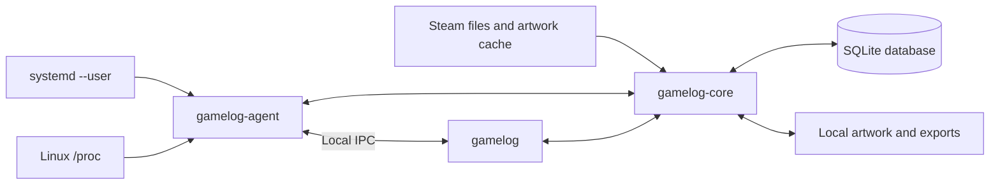
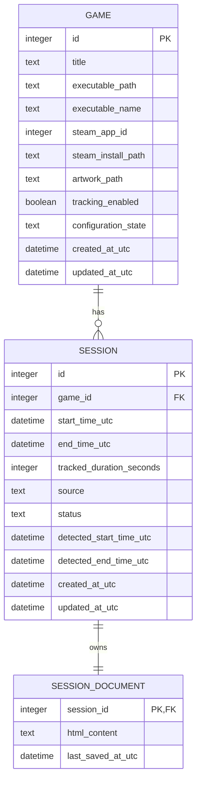
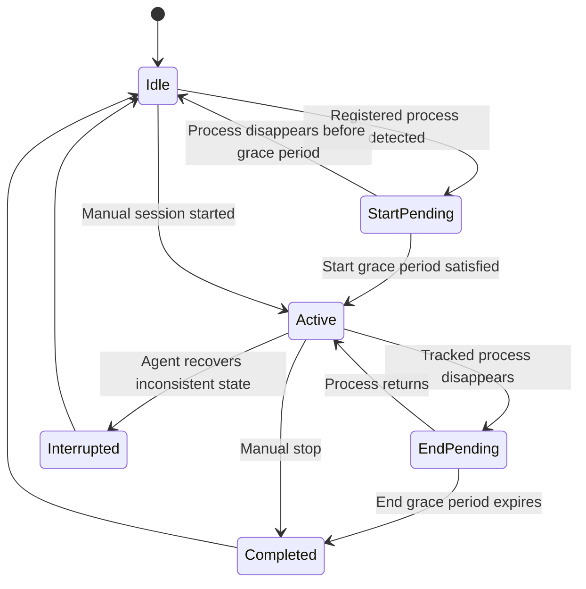

# GameLog Software Design Document

**Document status:** Initial implementation design  
**Project type:** Solo portfolio project  
**Primary platform:** Linux desktop, with Dank Linux / Dank Material Shell on Wayland as the initial development environment  
**Working language and framework:** C++23 and Qt 6  
**Working name:** GameLog

---

## 1. Purpose

GameLog is a lightweight, local desktop application for automatically tracking PC game sessions. It detects when a registered game starts, records the session, allows the user to take timestamped rich-text notes, and presents historical play information through a desktop GUI.

The application is inspired by game-tracking and backlog-management services such as Backloggd, but its first version is focused on **local session tracking** rather than social features or comprehensive backlog management.

This document is intended to guide implementation by a solo developer. It deliberately omits enterprise-oriented concerns such as cloud scaling, multi-user authorization, distributed services, and organizational deployment environments.

---

## 2. Project Goals

### 2.1 Base goals

The first complete version of GameLog should:

- Run a lightweight game-detection agent in the background.
- Start the agent automatically at desktop login when the user enables that option.
- Detect registered games by inspecting running Linux processes.
- Import installed Steam games and assist the user in associating them with executable processes.
- Allow any application to be registered manually as a game.
- Track exactly one active session at a time.
- Record:
  - Game played
  - Session start time
  - Session end time
  - Tracked duration
  - Session source, such as automatic or manual
  - Timestamped rich-text notes
- Display a system tray icon while the GUI is running.
- Support configurable session UI modes:
  - Tray only
  - Minimal elapsed-time display
  - Compact session panel
  - Full note-taking panel
  - Full application
- Allow completed sessions to be edited or deleted.
- Display per-game summaries and a basic calendar highlighting every day on which the game was played.
- Store all application data locally in SQLite.
- Retrieve game artwork from the local Steam installation when available.
- Allow manual artwork selection when automatic Steam artwork retrieval fails.
- Export session notes as HTML files.
- Remain modular enough to support additional launch configurations, artwork providers, platforms, and integrations later.

### 2.2 Learning goals

The project should provide practical experience with:

- Modern C++ application development
- Qt desktop application architecture
- Linux process inspection through `/proc`
- Inter-process communication
- SQLite database design
- CMake
- systemd user services
- Steam library file parsing
- Wayland desktop behavior
- Packaging through an Arch Linux `PKGBUILD`
- Automated testing of system-facing code

### 2.3 Non-goals for Version 1

The following are explicitly outside the first-version scope:

- Cloud hosting
- User accounts or authentication
- Multiple users
- Social features
- Online synchronization
- Full backlog and wishlist management
- Backloggd synchronization
- Audio recording
- Speech transcription
- AI-generated summaries
- In-game overlays
- Automatic manipulation of game windows
- Multi-session tracking
- Windows or macOS support
- Other game launchers beyond manually registered applications and Steam
- Multiple launch profiles per game
- Advanced session splitting and merging
- Broad Linux packaging support

These may be considered after the base application is stable.

---

## 3. Core User Experience

### 3.1 First-run setup

On first launch, GameLog should guide the user through:

1. Selecting or confirming the Steam installation location.
2. Importing installed Steam games.
3. Choosing whether the background agent starts automatically at desktop login.
4. Selecting the default behavior when a session starts:
   - Tray only
   - Minimal timer
   - Compact session panel
   - Notes panel
   - Full application
5. Choosing the default process-detection polling interval.
6. Reviewing where GameLog stores its local data.

The startup service must never be enabled without the user's confirmation.

### 3.2 Registering games

Games can enter the GameLog library in two ways.

#### Steam import

GameLog reads Steam library configuration and application manifests to obtain:

- Steam App ID
- Title
- Install directory
- Installation state
- Locally available artwork

Imported games that do not yet have a confirmed executable are marked as **Unconfigured**.

When the user launches an unconfigured Steam game, GameLog may present candidate processes that appeared during the launch. The user selects the process that represents the game. That executable becomes the game's detection target.

#### Manual registration

The user can manually create a game entry by supplying:

- Title
- Executable path
- Optional Steam App ID
- Optional install directory
- Optional artwork file

Any executable application may be registered. GameLog does not require the application to be launched through Steam.

### 3.3 Automatic session flow

1. `gamelog-agent` detects a registered executable.
2. The process remains detected for the configured start grace period.
3. If no session is already active, the agent creates a new active session.
4. The agent launches `gamelog` in the configured UI mode.
5. The GUI connects to the agent and displays the active session.
6. The user may add timestamped notes at any time.
7. When the game process disappears, the end grace period begins.
8. If the process returns during the grace period, the session continues.
9. If the process remains absent, the agent completes the session.
10. If the full application window is not visible, tray-only or session-panel GUI instances exit automatically.
11. The completed session appears in the game's history and calendar.

### 3.4 Manual session flow

The user can manually start a session for any registered game.

A manual session:

- Is subject to the same one-active-session rule.
- Can be ended manually.
- May optionally end automatically if the associated registered process closes.
- Is labeled as manually started in session history.

For Version 1, the default behavior should be to end a manual session only when the user explicitly stops it. Automatic ending can be added as a per-game option later.

### 3.5 One active session rule

GameLog supports exactly one active session.

When a session is active:

- No automatic session may start for another game.
- No manual session may start for another game.
- Other recognized processes are ignored for session creation.
- The agent may log that another registered game was detected for diagnostic purposes.
- The GUI should display a clear message if the user attempts to start another session.

This rule is enforced by the session-management layer rather than only by the GUI.

---

## 4. System Architecture

GameLog uses two executables and one shared static library.



### 4.1 `gamelog-agent`

A lightweight, non-windowed background process responsible for:

- Monitoring processes
- Matching processes to registered games
- Enforcing the one-active-session rule
- Applying start and end grace periods
- Creating and completing sessions
- Checkpointing active-session state
- Recovering interrupted sessions
- Receiving manual start and stop commands
- Launching the GUI when needed
- Hosting the local IPC server

The agent should link only the Qt modules and GameLog components it needs. It should not initialize calendar views, rich-text widgets, or other heavy GUI components.

### 4.2 `gamelog`

The Qt Widgets desktop application responsible for:

- System tray controls
- Current-session displays
- Rich-text note editing
- Game library management
- Session history
- Session editing
- Per-game statistics
- Calendar views
- Steam import controls
- Artwork selection
- Settings
- Note export

Only one GUI process should run at a time. New launch requests should activate or reconfigure the existing GUI process.

### 4.3 `gamelog-core`

A shared static C++ library linked into both executables.

It contains:

- Domain models
- Database repositories
- Session-management rules
- Process matching
- Steam discovery
- Artwork provider interfaces
- IPC message definitions
- Serialization
- Settings abstractions
- Logging utilities
- Common error types

A static library is preferred initially to avoid runtime shared-library installation and compatibility issues.

---

## 5. Technology Stack

| Area | Technology |
|---|---|
| Language | C++23 |
| GUI | Qt 6 Widgets |
| Core Qt modules | Qt Core, Qt Widgets, Qt GUI, Qt SQL, Qt Network |
| Database | SQLite |
| Database access | Qt SQL with repository classes |
| Build system | CMake |
| Testing | Qt Test and CTest |
| IPC | `QLocalServer` and `QLocalSocket` |
| IPC payload | Length-prefixed JSON |
| Process discovery | Linux `/proc` filesystem |
| Startup service | systemd user service |
| Configuration | `QSettings` |
| Rich-text editor | `QTextEdit` / `QTextDocument` |
| Note storage | HTML |
| Logging | `QLoggingCategory` with local log files |
| Initial packaging | Manual CMake install |
| Later packaging | Arch Linux `PKGBUILD` |

The build must require C++23 rather than silently falling back to an older standard.

```cmake
set(CMAKE_CXX_STANDARD 23)
set(CMAKE_CXX_STANDARD_REQUIRED ON)
set(CMAKE_CXX_EXTENSIONS OFF)
```

The project should use a recent Qt 6 release available on the development system. The code should avoid depending on a newly introduced Qt API unless the minimum Qt version is explicitly updated.

---

## 6. Suggested Repository Layout

```text
gamelog/
├── CMakeLists.txt
├── cmake/
├── docs/
│   └── SoftwareDesignDocument.md
├── packaging/
│   ├── systemd/
│   │   └── gamelog-agent.service
│   └── arch/
│       └── PKGBUILD
├── resources/
│   ├── icons/
│   └── migrations/
├── src/
│   ├── core/
│   │   ├── domain/
│   │   ├── database/
│   │   ├── ipc/
│   │   ├── process/
│   │   ├── sessions/
│   │   ├── steam/
│   │   ├── artwork/
│   │   ├── settings/
│   │   └── logging/
│   ├── agent/
│   └── gui/
│       ├── application/
│       ├── tray/
│       ├── active_session/
│       ├── library/
│       ├── history/
│       ├── calendar/
│       ├── notes/
│       └── settings/
└── tests/
    ├── unit/
    ├── integration/
    └── fixtures/
```

---

## 7. Domain Model

### 7.1 Game

A `Game` represents one trackable game.

Version 1 allows one executable detection target per game.

Suggested fields:

- Internal ID
- Title
- Executable path
- Executable filename
- Optional Steam App ID
- Optional Steam install directory
- Optional artwork path
- Tracking enabled
- Configuration state
- Created timestamp
- Updated timestamp

A future version may replace the single executable fields with a collection of launch profiles without changing the meaning of `Game`.

### 7.2 Session

A `Session` represents one period of tracked play.

Suggested fields:

- Internal ID
- Game ID
- Start timestamp in UTC
- End timestamp in UTC
- Tracked duration in seconds
- Session source:
  - Automatic
  - Manual
- Session status:
  - Active
  - Completed
  - Interrupted
- Original detected start timestamp
- Original detected end timestamp
- Created timestamp
- Updated timestamp

The original detected timestamps are preserved so that a user can edit the displayed start or end times without losing the initial automatic values.

### 7.3 Session note document

Each session owns exactly one rich-text note document.

The document:

- Is stored as HTML text in SQLite.
- Contains any number of timestamped entries.
- Is edited through a WYSIWYG editor.
- Can be exported to an `.html` file.
- Is autosaved.
- Is not stored in multiple interchangeable formats.

A timestamped entry may be represented in the HTML with semantic attributes:

```html
<section class="session-note" data-offset-seconds="1842">
  <header>00:30:42</header>
  <p>Reached the second area and found the locked gate.</p>
</section>
```

The application controls the generated HTML. Arbitrary scripts or externally loaded active content must not be allowed.

### 7.4 Application settings

Settings include:

- Start agent at login
- Process polling interval
- Start grace period
- End grace period
- Default session UI mode
- Whether compact windows stay on top
- Last-used window positions and sizes
- Steam installation path
- Default export directory
- Logging level

Settings should be stored through `QSettings`. Domain data should remain in SQLite.

---

## 8. Database Design

### 8.1 Entity relationship diagram



### 8.2 Suggested schema constraints

#### `games`

- `id` is the primary key.
- `title` is required.
- `executable_path` may be null while a Steam import remains unconfigured.
- `steam_app_id` may be null.
- `tracking_enabled` defaults to true after configuration.
- `configuration_state` is one of:
  - `unconfigured`
  - `configured`
  - `disabled`

#### `sessions`

- `game_id` references `games.id`.
- `start_time_utc` is required.
- `end_time_utc` is null only for an active session.
- `tracked_duration_seconds` defaults to zero.
- `status` is one of:
  - `active`
  - `completed`
  - `interrupted`
- `source` is one of:
  - `automatic`
  - `manual`
- A database-level partial unique index should be used when supported to guarantee that only one row can have `status = 'active'`.

Example:

```sql
CREATE UNIQUE INDEX one_active_session
ON sessions(status)
WHERE status = 'active';
```

The session manager must still enforce the rule before attempting inserts so that the user receives a meaningful error.

#### `session_documents`

- `session_id` is both the primary key and foreign key.
- Deleting a session should delete its document through a cascading foreign-key rule.
- `html_content` defaults to an empty valid document.

### 8.3 Migrations

Schema changes should be handled through numbered SQL migration files.

```text
resources/migrations/
├── 001_initial_schema.sql
├── 002_add_detected_timestamps.sql
└── 003_add_artwork_metadata.sql
```

A `schema_version` table records completed migrations. Migrations run before either executable uses the database.

Database backups should be created before destructive migrations.

---

## 9. Local Data Locations

GameLog should follow Linux user-directory conventions.

Suggested paths:

```text
~/.local/share/gamelog/
├── gamelog.sqlite
├── artwork/
├── exports/
└── logs/

~/.config/gamelog/
└── gamelog.conf
```

The implementation should use Qt standard-path APIs rather than hard-coding these paths.

The application should copy selected Steam artwork into its own artwork directory. It should not permanently depend on Steam's cache retaining the original file.

---

## 10. Process Detection

### 10.1 Version 1 approach

The agent polls `/proc` at a configurable interval, initially three seconds.

For each numeric process directory, the detector may inspect:

- `/proc/<pid>/exe`
- `/proc/<pid>/cmdline`
- `/proc/<pid>/status`

The detector should ignore processes owned by other users and gracefully handle files disappearing while they are being read.

### 10.2 Matching order

Version 1 should match a registered game in this order:

1. Exact canonical executable path
2. Executable filename fallback

Exact path matching is preferred because filenames are not necessarily unique.

Steam App IDs assist discovery and metadata import but are not themselves sufficient to prove which process is the game.

### 10.3 Detection timing

Recommended defaults:

- Polling interval: 3 seconds
- Start grace period: 5 seconds
- End grace period: 30 seconds

These values should be configurable.

The start grace period prevents very short-lived helper processes from creating sessions. The end grace period allows games that restart or replace a process to continue the same session.

### 10.4 Tracked duration

GameLog should store both wall-clock timestamps and an accumulated tracked duration.

Tracked duration should be calculated using a monotonic clock and checkpointed periodically. This avoids counting long system suspends as active play when the platform clock behavior permits.

The agent should checkpoint:

- Active session ID
- Last observed process state
- Accumulated tracked duration
- Last checkpoint time

A crash or forced shutdown should not lose the entire session.

### 10.5 Process abstraction

The `/proc` reader must be hidden behind an interface so that it can be tested without scanning the developer's real machine.

```cpp
class ProcessSource
{
public:
    virtual ~ProcessSource() = default;
    virtual std::vector<ProcessInfo> listProcesses() = 0;
};
```

Implementations:

- `ProcfsProcessSource`
- `FakeProcessSource` for tests

This also allows future Windows or macOS process sources.

---

## 11. Session State Management

The agent owns session lifecycle decisions.



### 11.1 Session manager responsibilities

The session manager must:

- Reject a new session when another is active.
- Create session records transactionally.
- Update checkpoints.
- Complete sessions.
- Preserve original detection times.
- Notify connected GUI clients.
- Recover incomplete active sessions after restart.
- Return structured errors rather than generic failures.

Example errors:

- `SessionAlreadyActive`
- `GameNotConfigured`
- `GameNotFound`
- `DatabaseUnavailable`
- `InvalidSessionTransition`

---

## 12. Inter-Process Communication

### 12.1 Transport

The agent hosts a `QLocalServer`. The GUI connects with `QLocalSocket`.

The local socket should be available only to the current user. No TCP port is required.

### 12.2 Protocol

Messages use UTF-8 JSON with a four-byte length prefix.

Each request contains:

- Protocol version
- Message type
- Request ID
- Payload

Example:

```json
{
  "protocol_version": 1,
  "type": "end_session",
  "request_id": 42,
  "payload": {
    "session_id": 81
  }
}
```

Each request receives either:

- A success response
- A structured error response

Events may be sent without a request:

```json
{
  "protocol_version": 1,
  "type": "session_started",
  "payload": {
    "session_id": 81,
    "game_id": 12
  }
}
```

### 12.3 Initial message set

GUI to agent:

- `get_agent_status`
- `get_active_session`
- `start_manual_session`
- `end_active_session`
- `pause_detection`
- `resume_detection`
- `reload_settings`
- `shutdown_agent`

Agent to GUI:

- `agent_status`
- `session_started`
- `session_updated`
- `session_ended`
- `detection_paused`
- `detection_resumed`
- `error`

### 12.4 Ownership rules

The agent is authoritative for:

- Detection state
- Active-session identity
- Session start and end
- Grace periods
- Manual session commands

The GUI is authoritative for:

- User-visible edits
- Notes
- Library metadata
- Artwork choices
- Calendar and history presentation

Completed-session edits may be written directly through the shared repository layer. Active-session lifecycle changes must go through the agent.

---

## 13. GUI Design

### 13.1 Main application modes

The same `gamelog` executable supports several startup modes:

```text
gamelog --tray
gamelog --minimal
gamelog --session-panel
gamelog --notes
gamelog --full
```

Only one GUI process runs. A later invocation sends an activation request to the existing process.

### 13.2 GUI lifecycle rules

- At login, only the agent is required to run.
- When a session starts, the agent launches the GUI in the configured mode.
- If only the tray, minimal timer, compact panel, or notes panel is active, the GUI exits automatically when the session ends.
- If the full application window is visible, the GUI remains open after the session ends.
- Closing the full application window exits the GUI process completely.
- Closing the full window must not leave a hidden tray process running.
- If the GUI closes during an active session, the agent continues tracking.
- The user may reopen the GUI manually at any time.

### 13.3 System tray

The tray icon belongs to `gamelog`, not `gamelog-agent`.

Suggested actions:

- Open GameLog
- Open current session
- Start manual session
- End current session
- Pause or resume detection
- Show current game and elapsed time
- Exit GUI

Exiting the GUI does not stop the agent.

### 13.4 Main window sections

#### Library

Displays:

- Game artwork
- Title
- Configuration state
- Total playtime
- Last played date

Actions:

- Import Steam games
- Add game manually
- Edit game
- Disable tracking
- Remove game

#### Game detail

Displays:

- Artwork
- Title
- Total tracked playtime
- Session count
- First played date
- Last played date
- Average session duration
- Longest session
- Played-days calendar
- Recent sessions
- Recent notes

#### Session history

Displays sessions in reverse chronological order.

Filters:

- Game
- Date range
- Automatic or manual
- Completed or interrupted

#### Session editor

Allows:

- Reassigning the game
- Editing start time
- Editing end time
- Editing notes
- Viewing original detected times
- Deleting the session

Merging and splitting sessions are deferred.

#### Settings

Includes:

- Login startup
- Polling interval
- Grace periods
- Default session UI mode
- Always-on-top preferences
- Steam path
- Data location
- Export location
- Logging level

### 13.5 Current-session panel

The current-session panel is a user-positioned desktop window. It does not resize or reposition the game.

Possible configurations:

- Invisible, with tray only
- Title and elapsed time
- Compact controls
- Full rich-text note editor

The panel should:

- Remember position and size
- Optionally remain always on top
- Show the current game
- Show elapsed tracked time
- Add timestamped note entries
- End the current session
- Hide without ending the session

The initial environment is Wayland through Dank Linux and Dank Material Shell. The implementation should remain generic and avoid desktop-specific APIs where possible.

---

## 14. Note Editor Design

### 14.1 Editor

The note editor should be built with Qt's WYSIWYG rich-text components:

- `QTextEdit`
- `QTextDocument`
- `QTextCursor`

The user sees rendered formatting rather than HTML or Markdown syntax.

### 14.2 Canonical format

HTML is the only storage format.

GameLog will not offer interchangeable HTML and Markdown storage modes.

### 14.3 Formatting features

Version 1 should support:

- Bold
- Italic
- Underline
- Strikethrough
- Headings
- Bulleted lists
- Numbered lists
- Undo and redo
- Keyboard shortcuts
- Insert timestamped entry

Checklist support may be included if it can be implemented cleanly without delaying the core editor.

### 14.4 Timestamped entries

Adding an entry should:

1. Read the active session's tracked duration.
2. Insert a new visually distinct section.
3. Display the offset as `HH:MM:SS`.
4. Place the cursor in the new section.
5. Autosave after a short debounce interval.

The document may also include an untimestamped summary section at the top or bottom, but timestamped entries are the primary note structure.

### 14.5 Autosave

Notes should autosave after:

- A short idle delay after editing
- Focus loss
- Window close
- Session end

Autosave failures must be shown clearly without discarding the in-memory document.

### 14.6 Export

The session editor provides **Export Notes**.

Exported HTML should include:

- Game title
- Session date
- Start and end time
- Tracked duration
- Timestamped notes
- Basic embedded styling

The export should not depend on external CSS or images unless the user explicitly chooses to include them.

---

## 15. Steam Integration

### 15.1 Steam discovery

GameLog should locate Steam through:

- Common Linux Steam paths
- User-selected path
- Previously stored setting

It reads:

- Steam library configuration
- `appmanifest_*.acf` files
- Installed-game metadata
- Local artwork caches

Steam files are treated as read-only.

### 15.2 Import behavior

The Steam importer creates or updates game entries using Steam App ID as the stable external identifier.

The importer must not overwrite user-edited fields without confirmation.

Imported games may remain unconfigured until an executable is selected.

### 15.3 Assisted executable registration

Version 1 should support an assisted workflow:

1. User selects an unconfigured Steam game.
2. GameLog records a baseline process snapshot.
3. User launches the game.
4. GameLog observes newly appearing processes.
5. Candidate executables are ranked using:
   - Location inside the game's install directory
   - Process lifetime
   - Executable type
   - Exclusion of known helpers
6. User confirms the correct executable.

Automatic Proton and launcher handling may improve later, but the user remains the final authority in Version 1.

### 15.4 Artwork

Artwork access is defined through a generic interface.

```cpp
class ArtworkProvider
{
public:
    virtual ~ArtworkProvider() = default;
    virtual ArtworkResult findArtwork(const GameIdentity& game) = 0;
};
```

Version 1 providers:

- `SteamArtworkProvider`
- `ManualArtworkProvider`

The Steam provider searches locally available Steam artwork using the App ID. When suitable artwork is found, GameLog copies it into its own data directory.

No external artwork API is required for Version 1.

---

## 16. Startup and Deployment

### 16.1 systemd user service

The background agent runs as the logged-in user.

It must not run as root or as a system-wide daemon.

Conceptual unit:

```ini
[Unit]
Description=GameLog game detection agent

[Service]
Type=simple
ExecStart=/usr/bin/gamelog-agent
Restart=on-failure
RestartSec=3

[Install]
WantedBy=default.target
```

The setup UI should enable or disable the service using `systemctl --user`.

The implementation must verify that a graphical program launched by the agent receives the correct Wayland environment. This is a platform-integration test item, not an assumption.

### 16.2 Development installation

Initial development can use:

```bash
cmake -S . -B build
cmake --build build
ctest --test-dir build
cmake --install build
```

Installation should place:

- Executables in the selected binary directory
- Desktop entry and icons in user or system application directories
- systemd user unit in the appropriate user-unit directory
- No mutable application data in the installation directory

### 16.3 Packaging roadmap

1. Build and run from the source tree.
2. Support `cmake --install`.
3. Create an Arch Linux `PKGBUILD`.
4. Consider AppImage, Flatpak, or distribution packages only after the Linux integration is stable.

---

## 17. Error Handling and Recovery

### 17.1 General approach

Core operations should return structured results or domain-specific errors.

Errors should include:

- Stable error code
- Human-readable message
- Technical context for logs
- Whether retry is appropriate

Expected system errors must not terminate the agent.

### 17.2 Process errors

The `/proc` scanner must expect:

- Processes disappearing between reads
- Permission failures
- Broken executable links
- Empty command lines
- Zombie processes
- Executables being replaced during updates

These should normally be skipped or logged at a low severity.

### 17.3 Database errors

Database writes affecting session lifecycle must use transactions.

If the database becomes unavailable:

- The agent should not create a second session.
- The active state should remain in memory when possible.
- The user should receive a visible warning when the GUI connects.
- Recovery should prefer preserving session information over silently discarding it.

### 17.4 Agent restart

On startup, the agent checks for an existing active session.

If one exists:

- If the registered process is still present, tracking resumes.
- If it is absent, the session is completed or marked interrupted using the last checkpoint.
- The decision is logged.
- The user can correct the completed session later.

### 17.5 GUI failure

The GUI is not required for tracking.

If it crashes or closes:

- The agent continues the session.
- Notes saved before the last successful autosave remain available.
- Reopening the GUI reconnects to the active session.

---

## 18. Performance Requirements

The application is intended to run alongside games and should minimize unnecessary resource usage.

### 18.1 Agent targets

Initial performance targets:

- Idle CPU use should remain difficult to distinguish from zero during normal polling.
- Average idle CPU should remain below approximately 0.5% on the development machine.
- Idle memory should remain below approximately 50 MB.
- No disk write should occur on every process poll.
- Session checkpoints should be periodic rather than continuous.
- Steam library scans should occur on demand or at controlled intervals.

These are engineering targets rather than absolute compatibility guarantees.

### 18.2 GUI behavior

The GUI may use more memory than the agent but should:

- Construct heavy pages lazily.
- Avoid loading every session note document at startup.
- Use paginated or incremental history queries.
- Cache scaled artwork thumbnails.
- Release session-only windows when they close.

### 18.3 Database indexes

Suggested indexes:

- `sessions(game_id, start_time_utc)`
- `sessions(start_time_utc)`
- `sessions(status)`
- `games(steam_app_id)`
- `games(executable_path)`

The calendar should query sessions intersecting a date range rather than loading all history.

---

## 19. Privacy and Security

### 19.1 Privacy model

GameLog is local-first.

Version 1:

- Does not require an account.
- Does not upload session data.
- Does not expose a network server.
- Does not collect telemetry.
- Reads Steam metadata locally.
- Stores notes locally.

### 19.2 Local IPC

The local socket must be restricted to the current user.

The agent should reject malformed or unsupported messages and enforce message-size limits.

### 19.3 Rich text

Stored HTML must be treated as application-controlled document content.

The editor and exporter should not execute:

- JavaScript
- Embedded active content
- Remote resources

Imported HTML is not a Version 1 feature.

### 19.4 Privileges

Neither executable should require root privileges.

The agent should inspect only process information available to the current user.

### 19.5 Backups

The application should eventually provide a simple backup command or UI action that copies:

- SQLite database
- Artwork directory
- Settings
- Optional exports

A first version may document manual backup locations instead.

---

## 20. Testing Strategy

### 20.1 Unit tests

Use Qt Test and CTest for:

- Game validation
- Session state transitions
- One-active-session enforcement
- Grace-period logic
- Duration calculations
- IPC serialization
- Steam manifest parsing
- Artwork-provider selection
- Calendar date intersection
- Repository queries
- HTML export generation

### 20.2 Database integration tests

Each database test should use a temporary SQLite file.

Test:

- Initial migration
- Sequential migrations
- Foreign keys
- Cascading note deletion
- Active-session unique constraint
- Transaction rollback
- Completed-session edits
- Recovery queries

### 20.3 Process-monitor integration tests

Use a fake process source to simulate:

- Game start
- Game stop
- Brief restart
- Helper process
- Two registered games starting
- Process disappearance during inspection
- Agent restart during an active session

A limited real `/proc` smoke test can verify the Linux implementation.

### 20.4 IPC tests

Test:

- Partial socket reads
- Multiple messages in one read
- Invalid length prefixes
- Unsupported protocol versions
- Request and response correlation
- GUI reconnection
- Agent unavailable errors

### 20.5 GUI tests

Automate critical widget behavior where practical:

- Note formatting
- Timestamp insertion
- Session field editing
- Tray actions
- Mode changes
- Closing the full window
- Autosave

Manual testing remains necessary for:

- Wayland tray behavior
- Always-on-top behavior
- Window restoration
- systemd environment propagation
- Steam and Proton launches
- Dank Material Shell integration

---

## 21. Logging and Diagnostics

Use named `QLoggingCategory` categories, for example:

```text
gamelog.agent
gamelog.process
gamelog.session
gamelog.database
gamelog.ipc
gamelog.steam
gamelog.gui
gamelog.notes
```

Logs should include:

- Agent startup and shutdown
- Database version
- Detection state changes
- Session transitions
- IPC connection errors
- Steam import summaries
- Recovery decisions

Logs should not include full note contents by default.

A diagnostics screen may later display:

- Agent status
- IPC status
- Database path
- Steam path
- Last process scan
- Active session
- Recent errors

---

## 22. Development Plan

### Milestone 0: Project skeleton

- Create CMake project.
- Create `gamelog-core`, `gamelog-agent`, and `gamelog`.
- Add Qt Test and CTest.
- Add logging.
- Add coding conventions and formatting tools.

### Milestone 1: Database and domain model

- Implement migrations.
- Implement `Game`, `Session`, and `SessionDocument`.
- Implement repositories.
- Add one-active-session constraint.
- Build a basic developer-only database viewer or test harness.

### Milestone 2: Manual sessions

- Build the agent IPC server.
- Build GUI IPC client.
- Start and stop manual sessions.
- Display active elapsed time.
- Recover a manual session after restart.

This milestone validates the architecture before `/proc` and Steam integration.

### Milestone 3: Process detection

- Implement process-source abstraction.
- Implement `/proc` reader.
- Implement executable matching.
- Implement start and end grace periods.
- Launch the GUI on automatic session start.

### Milestone 4: Core GUI and notes

- Add tray icon.
- Add compact session panel.
- Add WYSIWYG HTML note editor.
- Add timestamped entries.
- Add autosave and export.
- Implement GUI lifecycle rules.

### Milestone 5: Library and history

- Add game library.
- Add manual game registration.
- Add session history.
- Add session editing and deletion.
- Add per-game summary statistics.
- Add played-days calendar.

### Milestone 6: Steam integration

- Locate Steam.
- Parse libraries and manifests.
- Import installed games.
- Add assisted executable selection.
- Retrieve and copy local artwork.

Steam integration appears later so that the core application remains useful even if Steam parsing proves difficult.

### Milestone 7: Startup and packaging

- Add first-run startup option.
- Install systemd user service.
- Verify Wayland launch environment.
- Add `cmake --install`.
- Create a `PKGBUILD`.

### Milestone 8: Stabilization

- Profile idle agent usage.
- Test long-running sessions.
- Test crashes and restarts.
- Improve diagnostics.
- Document installation, backup, and recovery.

---

## 23. Risks and Tradeoffs

### 23.1 Steam formats are not a stable application API

Steam manifests and artwork caches may change.

Mitigation:

- Isolate Steam parsing behind interfaces.
- Fail gracefully.
- Preserve manual registration.
- Never make Steam mandatory.

### 23.2 Proton and launcher processes can be ambiguous

A Steam launch may create several processes.

Mitigation:

- Use assisted user confirmation.
- Prefer exact executable paths.
- Add launcher-specific heuristics later.
- Preserve modular launch-profile design.

### 23.3 Wayland desktop behavior varies

Tray icons, activation, and always-on-top behavior may differ across shells.

Mitigation:

- Test first on Dank Linux and Dank Material Shell.
- Use standard Qt behavior.
- Avoid shell-specific APIs in core logic.
- Treat optional window behaviors as noncritical.

### 23.4 A systemd user service may not inherit graphical environment variables

The agent must be able to launch a Qt GUI into the current session.

Mitigation:

- Test the actual desktop environment early.
- Keep GUI startup logic isolated.
- Allow the GUI to be launched manually if automatic activation fails.
- Document any required environment import.

### 23.5 Rich-text editing can expand in scope

Word-processor features can consume significant development time.

Mitigation:

- Use Qt's native rich-text model.
- Limit Version 1 formatting.
- Store controlled HTML.
- Defer advanced tables, embedded media, and collaborative features.

### 23.6 Session recovery is inherently approximate

A computer can crash before the latest checkpoint.

Mitigation:

- Checkpoint regularly.
- Preserve original detection data.
- Mark uncertain sessions as interrupted.
- Allow direct editing.

---

## 24. Future Extensions

Potential stretch features include:

- Multiple launch profiles per game
- Additional Linux launchers
- Windows and macOS process sources
- External artwork providers
- Full backlog and wishlist management
- Personal game ratings
- Tags and collections
- Global activity heatmaps
- Session merging and splitting
- Idle and focus-time tracking
- Backloggd integration
- Export to JSON or CSV
- Audio recording
- Local speech transcription
- AI-generated summaries
- Search across notes
- Plugin system
- Remote viewing through an optional local web interface

Future features should build on the core abstractions rather than be anticipated through premature complexity.

---

## 25. Version 1 Acceptance Criteria

Version 1 is complete when all of the following are true:

1. The application builds through documented CMake commands on the development system.
2. The agent can run through a systemd user service.
3. Startup at login is user-configurable.
4. A game can be registered manually.
5. Installed Steam games can be imported.
6. A Steam game can be associated with a process through an assisted flow.
7. The agent detects a registered process through `/proc`.
8. Automatic session start and end work with grace periods.
9. Only one session can be active.
10. Manual sessions can be started and stopped.
11. The GUI can run in tray, compact, notes, and full modes.
12. GUI lifecycle behavior follows the rules in this document.
13. Timestamped notes can be entered through a WYSIWYG editor.
14. Notes autosave as HTML in SQLite.
15. Notes can be exported as HTML.
16. Completed sessions can be edited and deleted.
17. Per-game total playtime and session history are displayed.
18. The calendar highlights every local date intersected by a session.
19. Steam artwork is copied locally when available.
20. Missing artwork can be selected manually.
21. Agent restart does not silently lose an active session.
22. Core session and database logic has automated tests.
23. The agent meets the initial idle-resource targets on the development machine.
24. Installation, startup, storage, backup, and troubleshooting are documented.

---

## 26. Glossary

**Agent**  
The lightweight `gamelog-agent` background process.

**Active session**  
The single session currently being tracked.

**Game configuration**  
The metadata and executable rule used to identify a game.

**Grace period**  
A delay that prevents short process changes from immediately starting or ending a session.

**IPC**  
Inter-process communication between the agent and GUI.

**Launch profile**  
A future abstraction representing one way a game can be launched and detected.

**Played day**  
A local calendar date during which any portion of a session occurred.

**Session document**  
The one HTML note document owned by a session.

**Tracked duration**  
Accumulated active playtime, which may differ from the simple difference between wall-clock start and end times.

---

## 27. Change History

| Version | Date | Author | Changes |
|---|---|---|---|
| 0.1 | 2026-07-27 | Kenneth Morse | Initial design created through requirements workshop |
